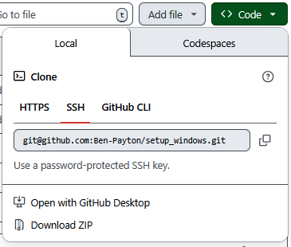

# Quick Use Guide:
On the home page for this repo click on the green Code Button

and download the repository your preferred way to the directory of your choice.
In the file system navigate to the folder you saved. Right click in the folder and select "open in command line". Then type `setup.bak` and answer information as prompted. 
# What this installs and Does:

## Installations:
> [!note]
> This is designed to be easy for the simple Windows computer user. There may be pieces I don't describe with the "most correct" term. That is not the point. If you know what this is in more detail that is great. I am trying to not scare people away from using useful software. Additionally, there may be alternatives you prefer. That's what forking a repo is for.
### [Firefox](https://www.mozilla.org/en-US/firefox/download/thanks/)
My prefered web browser over Edge.
### [Obsidian](https://help.obsidian.md/)
A mark down based note taking app with a robust community plugins.
### [Zotero](https://www.zotero.org/support/)
A citation manager that has a good plugin for the firefox browser and Microsoft Word that makes citing references easy.
### [Git](https://git-scm.com/)
Version control software commonly used by programmers to set "checkpoints" in their work.
### [VS Code](https://code.visualstudio.com/)
Text editor and programming software. Analogous to Word, but for code. 
### [Miniconda](https://learning.anaconda.com/courses/get-started-with-anaconda?utm_campaign=learning&utm_medium=documentation&utm_source=anacondadocs&utm_content=distroindexbutton)
Light weight Python programmin language environment and package manager.
### [R programming language](https://cran.r-project.org/manuals.html)
A statistics based programming language.
### [RStudio](https://posit.co/download/rstudio-desktop/)
Like VS Code but specifically for R.

## Sets up
These are the types of things that you only have to do once per computer and it's just hard to remember. Now you dont have to. It will guide you through it or simply do it for you.
### Git
Entering a username and email in to git are something you only need to do once per computer and then never again. It can be annoying to look up the command you need so this just gives you a prompt and then performs those commands for you.
### scienv Python Environment
a basic miniconda python environment with some common libraries installed below they are listed and described
- [numpy](https://numpy.org/doc/stable/): allows for fast linear algebra and array calculations
- [scipy](https://docs.scipy.org/doc/scipy/): contains functionality useful for statistics
- [matplotlib](https://matplotlib.org/): making plots and graphs
- [pandas](https://pandas.pydata.org/docs/): working with tabular data (like excel but python)
- [seaborn](https://seaborn.pydata.org/): builds on matplotlib to make plots prettier easier
- [jupyter](https://docs.jupyter.org/en/latest/): allows you to open python notebooks
- [ben_sci_tools](https://pypi.org/project/ben-sci-tools/): a package I have made for my convenience  
### Prefered User Directories
Makes some directories that I like to use as an organization system
- 01_Projects: This is where things with a specific end date go. (i.e. group_project1, class1_chapter2_notes, house_design).
- 02_Areas: This is where things that are a little more permanent than Projects go (i.e. class1, health).
- 03_Resources: This is where Anything you arent using, but may be useful later goes (i.e. tax_forms, lease).
- 04_Archive: Once things get to messy zip them in to a folder that has the days date and store it here.
